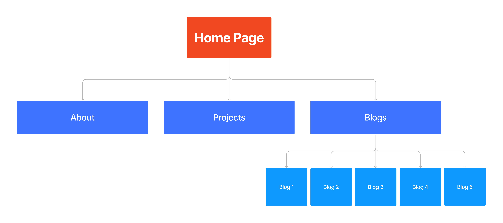

AdamDobsonT1A2 - Portfolio Documentation

Link to my Portfolio Website: https://dazzling-salmiakki-7a6e48.netlify.app/index.html
Link to GitHub Repository:

Purpose
The primary purpose of this portfolio website is to demonstrate my proficiency in web development to any future prospective employers. In addition to this, it will give any future employers a chance to get to know my personality, passions and interests. I plan on updating this website on a continual basis as I build new projects and learn more about web development.

Functionality and Features
This website has been built and designed for optimal accessibility and respsonsiveness on devices of all screen sizes - from small mobile screens, to tablets and all the way up to larger desktop screens. From a development standpoint, it was a priority that this website was constructed as semantically as possible in order to increase readability and performance. Whilst this website is rather simple in design, I believe this is an advantage as it is easy to navigate whilst also being aesthetically pleasing. I mostly used simple grayscale colors, with strategic splashes of brighter colors to accentuate specific areas and draw the attention of the user.

This website is composed of 5 sections that have all been linked to each other, these consist of:

- Home Page/Landing Page: The initial landing page that includes a brief introduction of myself and a self-portrait. The user is able to click on a number of links to find out more information about me.
- About: This page explains my background, past work history, hobbies, interests and goals for the future. Also contains a link to my personal resume PDF document.
- Projects: This page is intended to be a showcase for any other projects that I have created. I plan on adding to this in the future.
- Blog Home Page: This page contains 5 clickable sections, with each section linking to it's respective blog post.
- Individual Blog Posts: An article discussing a particular subject.

Sitemap

Screenshots
Mobile Screenshots

Tablet Screenshots

Desktop Screenshots

Target Audience

Tech Stack
